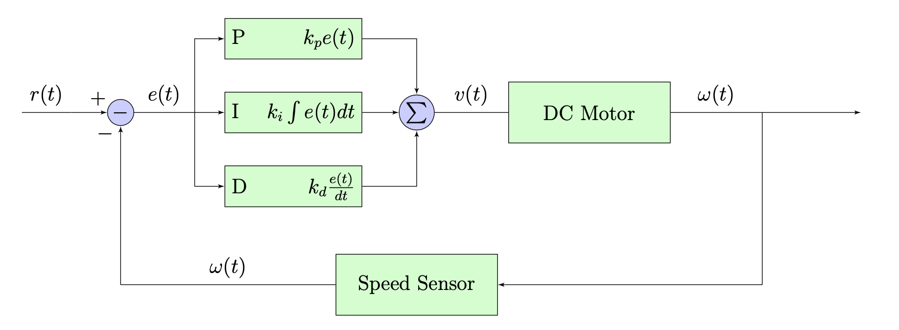
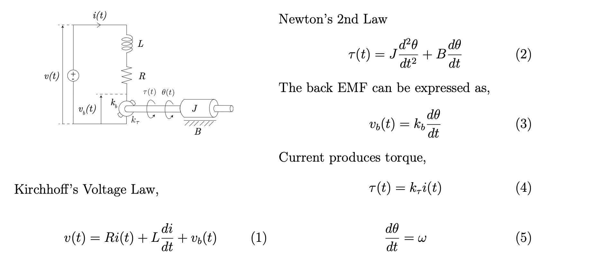
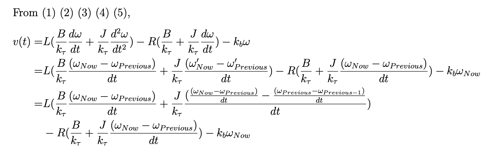
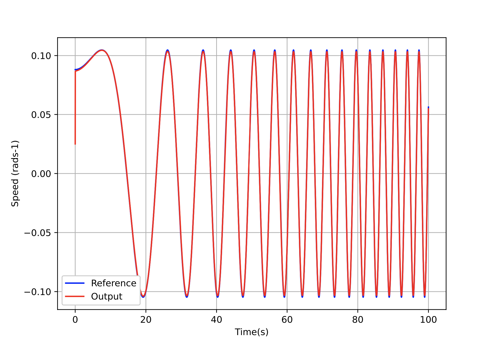

## PID Based Motor Velocity Controller Model

This is repository is dedicated to the second assignment of Automation and Control Techlnologies Module (EE4013). Assignement is to implement a motor with real-life parameters (taken from [Moog - C23-L33](https://www.moog.com/products/motors-servomotors/brush-motors/permanent-magnet-dc-servomotors/c23-series.html)) and implement a PID Controller to work with a given input function.

#### Control Block Diagram

#### Mathematical Model of Permanent Magnet DC Motor

I used the following function as the reference function
$$
Reference Function = sin(0.01t^2 + 0.001t +1)
$$

#### Results

with Kp = 200, Ki = 60, Kd = 20

